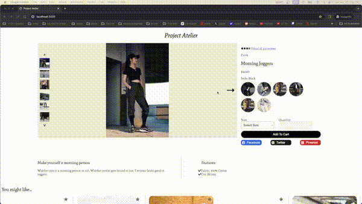
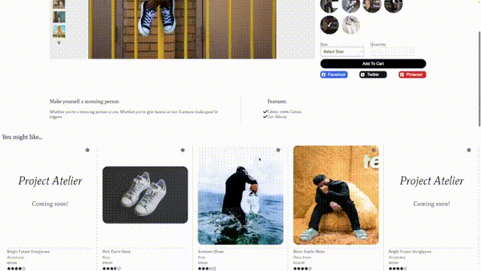
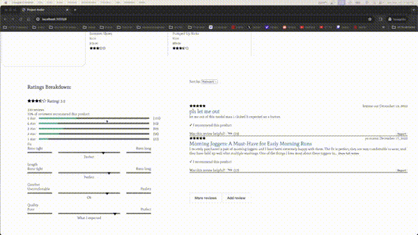

<a id='readme-top'> </a>

<h1 align="center"> Project Atelier </h1>


<details>
 <summary>Table of Contents</summary>

1. [Project Overview](https://github.com/Chic-Fil-Async/Project-Atelier?tab=readme-ov-file#project-overview)
2. [Getting Started](https://github.com/Chic-Fil-Async/Project-Atelier?tab=readme-ov-file#getting-started)
   - [Prerequsites](https://github.com/Chic-Fil-Async/Project-Atelier?tab=readme-ov-file#prerequisites)
   - [Installation](https://github.com/Chic-Fil-Async/Project-Atelier?tab=readme-ov-file#installation)
3. [Roadmap](https://github.com/Chic-Fil-Async/Project-Atelier?tab=readme-ov-file#roadmap)
4. [Usage](https://github.com/Chic-Fil-Async/Project-Atelier?tab=readme-ov-file#usage)
5. [Team Members](https://github.com/Chic-Fil-Async/Project-Atelier?tab=readme-ov-file#team-members)
   
</details>


## Project Overview

<div align="center">
  <h3>Product Overview</h3>
  
<br />
    <h3>Related Items</h3>
  
<br />
    <h3>Ratings and Reviews</h3>
  
</div>

<br />

<p>
Project Atelier is a sophisticated, client-oriented eCommerce portal designed to enhance the online shopping experience. At the heart of Atelier are features tailored towards comprehensive product insights and interactions. Fostering an engaging and shopping experience are:
</p>
<ul>
<li><b>The Product Detail Page</b>: A central hub that ensures a seamless decision-making process for the user, featuring a dynamic image gallery, detailed product information, a style selector, and an option to add products to the shopping cart</li>
<li><b>Related Items and User Outfit</b>: Enhancing further product discovery, this module presents users with two curated sets of products: one showcasing items similar to the currently viewed product, and another allowing users to create and manage a list of favorites for easy comparison and revisit</li>
<li><b>The Ratings and Reviews Module</b>: This module empowers users to browse through existing reviews and submit their own, providing valuable insights and feedback on products</li>
</ul>

### Built With


## Getting Started
<p>
    Instructions to setup Project Atelier on your local machine below.
</p>

### Prerequisites 

### Installation 

1. Clone the repo.

2. Install dependencies using: 
```
npm install 
```
3. Open two separate terminal tabs:

 - On the first terminal tab, run the command:
```
npm run server-dev
```

 - On the other terminal tab, run the command:
    
```
 npm run client-dev
```

 <p align="right">(<a href="#readme-top">back to top</a>)</p>

## Roadmap 


 <p align="right">(<a href="#readme-top">back to top</a>)</p>
 
## Usage

Pixel Pouch is run on the designated port. It can also be accessed utilizing localhost:PORT directly in the browser.

 <p align="right">(<a href="#readme-top">back to top</a>)</p>

## Team Members

<h3 align='center'>Chris Cheng</h3>
<h4 align='center'>
  <a href="https://linkedin.com/in/chengtchris">Linkedin</a> |
  <a href="https://github.com/chengtchris1">GitHub</a>
</h4>

<h3 align='center'>Maysie Ocera</h3>
<h4 align='center'>
  <a href="https://linkedin.com/in/maysieo">Linkedin</a> |
  <a href="https://github.com/maysieo">GitHub</a>
</h4>

<h3 align='center'>William Tucker</h3>
<h4 align='center'>
  <a href="https://linkedin.com/in/william-tucker-9b628462">Linkedin</a> |
  <a href="https://github.com/wtucker29">GitHub</a>
</h4>

 <p align="right">(<a href="#readme-top">back to top</a>)</p>
